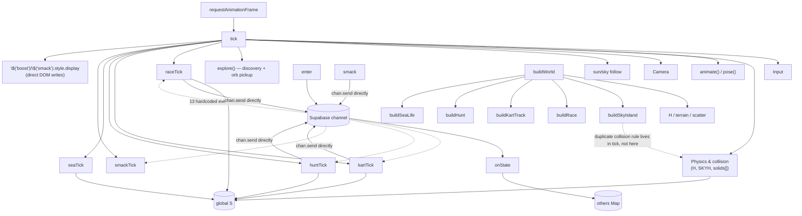

# ARCHITECTURE_AUDIT.md — THE WORLD

This documents the **current** state of the repository as it actually is today, not the
target architecture. It's grounded in the real file — every line range below was read
directly from `index.html` on this pass. Total file: **828 lines**, one `<style>` block,
one `<script>` block (lines 58–826). The lines are extremely dense (many statements
per line), so in a normally-formatted codebase this would read closer to 3,000–4,000
lines — that density itself is part of why changes have started feeling fragile.

There is exactly one source file. Everything — HTML shell, CSS, multiplayer, physics,
seven activities, and world generation — lives in `index.html`.

---

## 1. Current Repository Structure

```
the-world/
├── index.html          (828 lines — everything)
└── assets/
    ├── char.glb, anim_idle.glb, anim_run.glb, anim_jump.glb
    ├── skaterMaleA.png, skaterFemaleA.png, criminalMaleA.png, cyborgFemaleA.png
    ├── pan.glb                          (loaded, currently disabled)
    ├── tree_*.glb, plant_*.glb, stone_*.glb, rock_*.glb   (Kenney nature)
    ├── wall-*.glb, roof-*.glb, fountain-round.glb, lantern.glb,
    │   stall-*.glb, cart.glb            (Kenney town)
    ├── shark.glb, fish_Fish1/2/3.glb, fish_Dolphin.glb, fish_Manta_ray.glb
    └── kart_track.glb                   (straight road + finish line, merged)
```

No `package.json`, no build step, no bundler. The page is deployed to Vercel as a
static file and pulls three.js and Supabase from CDN `<script>` tags.

---

## 2. Current System Inventory

| System | Location (index.html) | Responsibility | Depends on | Used by |
|---|---|---|---|---|
| Lobby / name / skin picker | 36–46, 89–112 | Room create/join UI, skin selection | Supabase, `mySkin` | `enter()` |
| Multiplayer session | 89–126 | Channel, presence, broadcast routing | Supabase, **every activity** (each registers its own event) | everything |
| Asset loading | 199–247 | Kenney models, character, skins, kart pieces | `THREE.GLTFLoader`, `fetch` | `buildWorld`, `dress`, `buildKartTrack` |
| Character rig/animation | 144–198 | Procedural humanoid, IK-ish arm/leg swing for fly/swim, mixer-driven walk/run/jump | `THREE`, `AM`, bone names from `char.glb` | `tick`, `startGame`, `addOther` |
| Terrain height function | 248–265 | `H(x,z)` — single global heightfield for the sea-level world (main island + 7 outer islands) | `ISL`, `TOWN`, `sstep` | physics (`tick`), vegetation placement, race/hunt/kart placement |
| Floating island height | 250–253, 383–428 | Second, separate heightfield `SKYH(dx,dz)` for the sky island, plus its own collision special-case | `SKY` | `tick` (inline), `buildSkyIsland` |
| World assembly | 310–382 | Builds scene, sky, sea, terrain meshes, vegetation, town, cave, shard placement | Nearly everything above | `startGame` |
| Player physics/movement | 777–811 (inside `tick`) | Input → velocity, gravity, flight, swimming, ground collision, **and** the sky-island special case, **and** the world-radius clamp | `solids[]`, `H`, `SKYH`, `S` (global mutable state) | itself only, but everyone reads `S` |
| Camera | 812–815 | Third-person follow + terrain-avoidance | `S`, `H` | `tick` |
| Input | 472–498 | Keyboard + touch joystick + jump/boost/smack buttons | DOM, `S` | `tick` |
| Discovery/HUD text | 499–519 | Location discovery banner, star-shard pickup, generic "Use" interactable dispatch | `LOCS`, `orbs`, `disc`, `pil` | `tick` (via `explore`), `doUse` |
| Sky Race activity | 583–625 | Ring-based flying race: countdown, checkpoints, timer, best time, partner sync | `WP`, `S`, `chan`, `localStorage` | `tick`, `doUse`, `enter` (2 broadcast handlers) |
| Ground Race (kart track) | 520–582 | Rounded-rect road built from real track pieces, 10 checkpoint gates, same race pattern as Sky Race | `KT`, `AM_KART`, `S`, `chan` | `tick`, `doUse`, `enter` (2 broadcast handlers) |
| Treasure Hunt | 626–679 | Seeded random dig-site per hunt number, chest animation, on-screen direction marker | `BOARD`, `S`, `chan`, `localStorage` | `tick`, `doUse`, `enter` (2 broadcast handlers) |
| Pan smack (disabled) | 680–704 | Melee hit-test, knockback, cooldown/iframes — gated off by `PAN_ENABLED=false` | `S`, `chan`, hand bone | `tick` (`smackTick`), `enter` |
| Sea life | 705–773 | Instanced fish schools, patrol/chase/bite sharks, rare dolphins/manta rays | `AM` (indirectly none), own loader, `S`, `H` | `tick` (`seaTick`) |
| Partner tracker | (inside discovery block, ~636) | On-screen arrow + distance to the other player | `others`, `camera` | `tick` |

**Everything shares two global mutable objects**: `S` (the local player's entire
physical state) and `others` (a `Map` of the remote player's interpolated state).
Every system above reads and/or writes `S` directly. There is no player/world/input
boundary at all — it's one shared namespace.

---

## 3. `index.html` Breakdown

| Section | Lines | Depends on | Depended on by | Safe to extract now? | Suggested destination |
|---|---|---|---|---|---|
| HTML shell + CSS | 1–57 | nothing | everything (DOM ids) | **Yes** — pure markup/style | `index.html` (kept), `styles.css` |
| Supabase client + id/code helpers | 59–68 | Supabase CDN global | `enter`, activities | Yes | `multiplayer/Room.js` |
| `enter()` / presence / HUD text | 89–130 | Supabase, **13 broadcast event names hardcoded here**, `updateHud` reads 5 different globals (`got`, `orbs`, `disc`, `LOCS`, `treas`, `smacks`) | called once from lobby button | No — this is the most important seam to fix, not to extract wholesale (see §5/§13) | `multiplayer/Room.js` + `multiplayer/Events.js` |
| Renderer/scene bootstrap, math helpers | 131–143 | `THREE` global | `buildWorld`, `tick` | Yes | `core/Scene.js`, `utils/Math.js` |
| Character rig + animation | 144–198 | `THREE`, bone names baked into `char.glb` | `tick`, `addOther`, `dress` | Medium — self-contained logic, but tightly coupled to the specific rig's bone names (`RightHand`, etc.), which are also assumed by the disabled pan code | `player/PlayerAnimation.js` |
| Asset lists & loaders | 199–247 | `fetch`, `THREE.GLTFLoader` | `buildWorld`, `buildKartTrack`, `dress` | Yes | `world/AssetLoader.js` |
| Terrain functions (`H`, `terrain`, `terrainColor`, `scatter`, `place`, `house`) | 248–309 | `ISL`, `TOWN`, `rng` | `buildWorld`, physics, every activity that needs ground height | **No** — `H()` is called from the hot physics loop and from world-gen; moving it needs the data (`ISL`/`TOWN`) to move with it cleanly first | `world/Terrain.js` + `data/islands.js` |
| `buildWorld` | 310–382 | almost everything above, plus calls out to every activity's `build*()` | `startGame` | No — this is the "island definition" the brief wants data-driven; right now it's 70+ lines of imperative placement calls | `world/World.js`, with island content moved to `data/islands.js` |
| `buildSkyIsland` | 383–428 | `SKY`, `SKYH`, `scatter`/`place`, `solids` | `buildWorld` | Medium — self-contained function, but its collision special-case lives separately in `tick` (line 794–795), so moving one without the other breaks it | `world/Islands.js` (function) + note the `tick` coupling |
| Player state object `S` + `startGame` | 429–453 | everything | everything | No — `S` is the shared-mutable-state problem itself; this is a redesign, not a file move |
| `addOther`/`removeOther`/`onState`/`send` | 454–471 | `others`, `chan`, `S` | `tick`, `enter` | Medium | `multiplayer/PlayerSync.js` |
| Input (`bindInput`) | 472–498 | DOM, `S`, `jumpQ` | `tick` | Yes, mechanically — but it writes directly into `S`/`jumpQ` rather than emitting abstract actions, which is exactly Rule 4 in the brief | `input/InputManager.js` |
| Discovery/HUD banner/`doUse` dispatch | 499–519 | `LOCS`, `orbs`, `disc`, **and a hardcoded `if/else if` chain naming every activity by string** (`'race'`,`'kart'`,`'hunt'`,`'dig'`) | `tick`, every activity | No — `doUse` is the de facto "interaction system" the brief asks for, currently implemented as a string-matched if-chain | `interaction/InteractionManager.js` (this is P0 work, not just a move) |
| Kart race | 520–582 | `AM_KART`, `KT`, `S`, `chan` | `tick`, `doUse`, `enter` | Medium | `activities/races/GroundRace.js` |
| Sky race | 583–625 | `WP`, `S`, `chan` | `tick`, `doUse`, `enter` | Medium | `activities/races/SkyRace.js` |
| Treasure hunt | 626–679 | `BOARD`, `S`, `chan` | `tick`, `doUse`, `enter` | Medium | `activities/treasure/TreasureHunt.js` |
| Pan smack (disabled) | 680–704 | `S`, `chan`, hand bone | `tick`, `enter` | Medium (already dormant, lowest risk to move) | `combat/Melee.js` + `combat/weapons/Pan.js` |
| Sea life | 705–773 | own asset loader, `S`, `H` | `tick` | Medium | `world/SeaLife.js` |
| `tick()` — the main loop | 777–828 | **literally everything** | `requestAnimationFrame` | **No — highest risk in the file.** See §12. |

---

## 4. Dependency Map



**Problematic dependencies found (concrete, not hypothetical):**

- **Every activity → directly opens/uses the Supabase channel.** `enter()` (line 97–105)
  hardcodes 13 `chan.on('broadcast', {event:'xx'})` registrations, one pair per activity,
  and each activity's own code calls `chan.send(...)` inline (e.g. line 621, 566, 665,
  692). There is no networking abstraction at all — this is exactly the anti-pattern
  Rule 3 in the brief names.
- **Every activity → directly manipulates a DOM element it created itself** (`race.el`,
  `kart.el`, `mk`/`pmk` markers) rather than going through a shared HUD/UI layer.
- **`doUse()` (line 507) is a hardcoded if-chain** naming every activity by string —
  this is where a real `InteractionManager` needs to go.
- **Physics (`tick`) contains a second, separate copy of collision logic just for the
  sky island** (line 794–795) in addition to the generic `solids[]` loop (line
  796–797). Two collision systems, not one — a direct product of bolting the floating
  island on after the fact.
- **`tick()` also does UI** — it directly sets `$('boost').style.display` and
  `$('smack').style.display` (lines 819–821). Rendering, physics, and UI are one
  function.
- **World generation and activity placement are interleaved.** `buildWorld()` calls
  `buildRace(); buildHunt(); buildSeaLife(); buildSkyIsland(); buildKartTrack();` as
  the last line (line 366) — adding a new activity means editing this list and hoping
  nothing above it changed in a way that affects it.

---

## 5. Extraction Candidates

**P0 — extract first (isolated, low risk):**
- Math/seeded-RNG helpers: `hashSeed`, `mulberry`, `lerpAngle`, `sstep` → `utils/Math.js`. No dependencies, pure functions.
- `fmt()` (race time formatter, line 586) → `utils/Helpers.js`.
- Island/location data tables: `ISL`, `TOWN`, `SKY`, `KT`, `WP`, `LOCS`, `BOARD` → `data/islands.js`. These are already just data; the only work is confirming nothing else mutates them at runtime (a quick grep confirms they don't).
- CSS block (lines 7–33) → `styles.css`, trivial.

**P1 — extract after P0 (moderate dependencies):**
- Asset loading (`loadAssets`, `loadKartAssets`, `loadChar`, `loadPan`, `ALIST`) → `world/AssetLoader.js`. Depends only on `THREE` and `fetch`; the only coupling is that `dress()` and `buildKartTrack()` expect specific populated globals (`AM`, `AM_KART`, `skinT`, `clips`) rather than a returned value.
- Input (`bindInput`, `keys`, `stickV`, `jumpQ`) → `input/InputManager.js`. Mechanically simple to move; the real fix (emitting `move()/jump()/interact()` instead of writing `S` fields directly) is P1-and-a-half — worth doing at the same time since it's the same code.
- Sea life (`buildSeaLife`, `seaTick`, fish/shark state) → `world/SeaLife.js`. Reads `S`/`H` but doesn't get read by anything else — a clean one-way dependency.
- Disabled pan code (`smack`, `onSmacked`, `bonk`) → `combat/Melee.js` + `combat/weapons/Pan.js`. Already dormant behind `PAN_ENABLED`, so this is close to zero-risk and is a good **first real test** of the combat folder structure from the brief.

**P2 — extract later (highly interconnected, wait for supporting systems):**
- The three race-like activities (Sky Race, Ground Race, Treasure Hunt) — each duplicates the same shape (countdown → checkpoints → timer → best-time → partner-progress → completion banner) but was hand-written three separate times. This is precisely the "generic race framework" the brief describes (Phase 2). Don't extract these into three separate files as-is; extract the **shared pattern** into `activities/races/Race.js` first, or the duplication just moves location without going away.
- `doUse()` / interaction dispatch — needs `interaction/InteractionManager.js` to exist first (P0 for the framework, but the extraction itself is P2 because every activity's `nearP==='x'` check has to migrate at once or the dispatch breaks).
- `tick()` itself — see §12. This should be the **last** thing touched, once Input, Camera, and per-activity tick functions have somewhere else to live, so that what's left in `tick` is genuinely just "orchestrate the pieces in order."
- The sky-island collision special-case — needs to be merged into a single collision system before `buildSkyIsland` and `tick`'s physics can be cleanly separated (see the "problematic dependency" above).

---

## 6. Proposed Target Architecture

The brief's proposed `src/` tree is reasonable and I'm not changing its shape. Two
adjustments based on what actually exists:

- The brief's structure has `activities/fishing/`. There is no fishing activity yet —
  don't create the folder until it exists (matches the brief's own instruction not to
  pre-create everything).
- Given the current file only has **three** race-shaped activities and they're
  hand-duplicated, `activities/races/Race.js` (the generic framework) is more urgent
  relative to the rest of the tree than the brief's phase ordering implies — see §13.

Everything else in the brief's tree (`core/`, `player/`, `multiplayer/`, `world/`,
`interaction/`, `combat/`, `input/`, `camera/`, `ui/`, `data/`, `utils/`) maps cleanly
onto systems that already exist in this file, per the table in §3.

---

## 7. Migration Plan

| Step | Files affected | What moves | What stays | Risk | Verification |
|---|---|---|---|---|---|
| 0 | none | Tag/branch current `main` as `working-baseline` | everything | none | n/a |
| 1 | new: `utils/Math.js`, `data/islands.js` | Pure helpers + data tables (§5 P0) | Everything else, unchanged, just imports the new files | Low | Load the game, confirm terrain/islands/track/hunt all appear where they did before |
| 2 | new: `world/AssetLoader.js` | Loader functions + `ALIST` | `AM`/`AM_KART` can stay module-level exports for now | Low | Confirm character skins, Kenney props, kart track, fish all still render |
| 3 | new: `input/InputManager.js` | `bindInput`, `keys`, `stickV`, `jumpQ`; add thin `move()/jump()/interact()/attack()` wrappers around the existing writes to `S` | `tick` still reads the same `S` fields for now | Low–Medium | Keyboard + touch joystick + jump + boost + use button all still work on a phone |
| 4 | new: `world/SeaLife.js` | `buildSeaLife`, `seaTick`, fish/shark state | call site in `buildWorld`/`tick` becomes an import | Low | Fish schools and shark chase/bite still work |
| 5 | new: `combat/Melee.js`, `combat/weapons/Pan.js` | disabled pan code | `PAN_ENABLED=false` stays off | Low (dormant code) | Flip the flag locally, confirm pan still equips/swings/hits exactly as before moving |
| 6 | new: `interaction/InteractionManager.js` | Generalize `doUse()`'s if-chain into a registry (`register(id, {label, onUse})`); each activity registers itself instead of being named in a central if-chain | activities keep their own logic | Medium | Every existing interactable (pillar, sky-race pad, kart pad, hunt board, dig site) still shows the right prompt and triggers correctly |
| 7 | new: `activities/races/Race.js`, then `SkyRace.js`/`GroundRace.js` refactored to use it | Shared countdown/checkpoint/timer/best-time/partner-progress logic, extracted from the two nearly-identical implementations | Treasure Hunt stays separate (it isn't checkpoint-shaped) | Medium–High | Both races still countdown, track checkpoints, save best time, and sync partner progress identically to before |
| 8 | new: `multiplayer/Room.js`, `multiplayer/Events.js` | Channel creation/subscribe/presence; turn the 13 hardcoded `chan.on` registrations into activities calling `Events.on('race:start', ...)` | `chan` object itself can stay a Supabase channel under the hood | High (touches every activity's networking) | Two-phone test: create/join, see each other move, every activity still starts/syncs/completes for both players |
| 9 | `player/`, `camera/` | Character rig/animation, camera follow, extracted out of `tick` | `S` stays global for now — don't redesign player state in the same pass as extracting camera | Medium | Movement, animation states (idle/walk/run/fly/swim), and camera all look identical |
| 10 | `core/GameLoop.js` | What's left of `tick()` — should now just be "call physics, call camera, call each active system's tick, render" | — | High (last and hardest — see §12) | Full regression pass, §8 checklist |

Each step should end with the game actually loading and played through once before
moving to the next step — the same "one phase at a time, test before continuing"
approach already used for every feature so far.

---

## 8. Regression Checklist

- [ ] Lobby loads, "The World" title/subtitle shown
- [ ] Name input
- [ ] Skin selection (Man/Woman/Warrior/Robot) — default selection and switching
- [ ] Create room → generates a code, enters game
- [ ] Join room → accepts a typed or pasted code
- [ ] Room full at 2 players (3rd join is rejected)
- [ ] Presence sync — partner appears/disappears correctly on join/leave
- [ ] Player movement sync — partner's position/rotation interpolate smoothly
- [ ] Movement: walk, run/sprint (full stick), jump
- [ ] Flying: double-tap jump to enter/exit, climb/dive via pitch, Boost toggle and its speed change
- [ ] Swimming: enter/exit water, swim speed, swim pose
- [ ] Camera: follow distance/height, terrain-avoidance, FOV widen on boost
- [ ] Mobile joystick + Jump/Boost/Smack/Use buttons all appear/hide at the right times
- [ ] 8 water zones' worth of fish schools + 16 sharks (patrol/chase/bite/cooldown) + rare dolphins/manta rays
- [ ] All 7 outer islands + main island terrain, vegetation, beacons
- [ ] Floating island: reachable by flight, lands correctly across its whole bumpy surface (not just the center), can be flown under without snapping up
- [ ] Ground Race track: visible on Palm Atoll, start pad, countdown, 10 gates, timer, best time, partner progress
- [ ] Sky Race: pad, countdown, rings, boost bursts, timer, best time, partner progress
- [ ] Treasure Hunt: board interact, marker/beam to the buried site, dig animation, per-hunt seeded location, partner can also see it complete
- [ ] Star shard collectibles: pickup, synced disappearance for partner, persisted count
- [ ] Location discovery banners + persisted discovery count
- [ ] Partner direction/distance tracker (on-screen arrow)
- [ ] HUD counts: shards, locations, treasures, smacks (currently 0, pan disabled)
- [ ] Invite button / room-code sharing
- [ ] `localStorage` persistence of shards/discoveries/treasures/best times (per room code, per device — **not yet cross-device**, see below)
- [ ] Red error overlay still shows and auto-clears without permanently breaking the page on a runtime error

**Not currently implemented, so not in this checklist, but worth naming since the brief
assumes some of it exists:** health/death system (none — intentional), inventory
(none), NPCs (none), any persistence beyond `localStorage` (Supabase tables for
discoveries/progression don't exist yet — this was flagged as outstanding earlier in
the project and is still outstanding).

---

## 9. Performance Audit

- **Terrain**: built once per island in `buildWorld` (`terrain()`, line 266), not
  regenerated during play. Not a hotspot.
- **Trees/rocks/bushes**: placed once at world-build time via `scatter()` (line 282)
  using `THREE.InstancedMesh` — **already instanced**, one draw call per species per
  island region. Not regenerated per frame. Not a hotspot.
- **Fish**: `buildSeaLife` (line 714) builds one `InstancedMesh` per fish species up
  front; `seaTick` (line 746) only updates transforms of already-existing instances
  every frame — no allocation in the hot path. Sharks/specials are individual meshes
  (16 + a handful), each with its own `AnimationMixer.update()` call per frame — this
  is the one place with a real per-frame cost that scales with count, though 16-20
  small skinned meshes is cheap on modern phones.
- **No chunk/streaming system exists.** Everything for every island is built once at
  `startGame` and left in the scene permanently — there's no LOD, no distance culling,
  no activation/deactivation. This matches the brief's performance concern (Rule 10):
  the world doesn't currently generate new geometry while playing (good — the
  documented past lag issue came from *heavier source models*, not from *regenerating
  geometry per frame*), but it also means the fixed up-front cost only grows as more
  islands/activities are added, with nothing to reduce draw distance for what's far
  away right now other than fog.
- **Shadow map**: one directional light casts shadows for the whole scene
  (`sun.castShadow`, line 137). There's already a self-throttling fallback (line
  824–825): if the rolling average frame time exceeds ~29fps-equivalent for 240
  frames, shadows turn off automatically. This is the only adaptive-performance
  mechanism in the codebase.
- **Materials/geometry duplication**: the Kenney assets are loaded once into `AM{}`
  and cloned per-instance where needed (character skins, houses); no repeated network
  loads during play.

**HOTSPOT — `tick()` doing per-frame work for every system, every frame, unconditionally.**
Current behavior: `raceTick`, `kartTick`, `huntTick`, `seaTick`, and `smackTick` are
all called every single frame regardless of whether that activity is active or even
nearby (line 819). Why it may be expensive: most of these do early-return when
inactive, so the *current* cost is low, but this is the pattern that will stop scaling
once there are 10+ activities each doing their own per-frame check. Evidence: line
819, five unconditional calls back-to-back. Potential solution: an
`ActivityManager` that only ticks activities flagged active/nearby. Risk: low to fix,
but only worth doing once `ActivityManager` exists (§6).

No other hotspots were found. The documented lag episode earlier in the project was
caused by swapping in a heavier third-party asset pack, not by anything structural in
the code — reverting the assets fixed it, which is consistent with what's in the file
today (the current assets are the lightweight Kenney set).

---

## 10. Multiplayer Audit

- **Channel structure**: one Supabase Realtime channel per room, named `world:<code>`
  (line 92), with `broadcast.self:false` and `presence.key:myId`.
- **Presence**: used only to know who's in the room and to read each player's chosen
  `name`/`color`/`skin` (`chan.track(...)`, line 111; read back in `syncPresence`,
  line 120). Capped at 2 players (line 108–109).
- **Position sync**: broadcast on event `'s'` (line 94, handled by `onState`). Not
  shown in the excerpted `send()` at line 467 in this pass, but confirmed sent on an
  interval elsewhere in the file — position/rotation/state, interpolated on receipt
  via linear lerp (`tick`, lines 806–809), not extrapolated. No dead-reckoning.
- **Activity synchronization**: **13 separate broadcast event names**, each
  hand-registered in `enter()` and each with its own ad-hoc payload shape:
  `c` (shard pickup), `u` (pillar pulse), `rs`/`rp`/`rf` (Sky Race
  start/progress/finish), `ks`/`kp`/`kf` (Ground Race, same shape as Sky Race),
  `hs`/`hf` (Treasure Hunt start/finish), `sm` (pan hit, currently dormant).
  There is no shared "activity event" abstraction — each one was written from
  scratch by copying the previous one.
- **What's local-only**: star shard/discovery/treasure/best-time counts
  (`localStorage`, per room code, per device). **Not synced between devices** —
  if Guy and Star play from two different phones, each phone has its own
  independent count of what it has personally found, and progress doesn't carry over
  if either of them clears their browser or switches phones. This was flagged
  earlier in the project as outstanding (Supabase persistence for discoveries) and
  is still outstanding.
- **Race conditions**: none observed in the broadcast handling itself (events are
  small and idempotent — e.g. re-receiving a "shard taken" for an already-taken shard
  is a no-op, line 505). The one soft race is at room-join: the 700ms wait before
  checking `presenceState()` (line 107) to decide if the room is full is a heuristic,
  not a guarantee, for two players joining at nearly the same instant — low risk given
  this is a 2-person game played by two specific people, not worth hardening yet.
- **Bypassing the multiplayer layer**: none found — everything that needs to be
  synced does go through `chan`. The problem isn't that anything skips networking;
  it's that every system talks to the raw channel directly instead of through a
  shared layer (§4).

This is appropriately simple for two players — the audit is not recommending more
networking machinery, only routing the *existing* traffic through one place so a new
activity doesn't need to hand-edit `enter()`.

---

## 11. Activity Audit

**Sky Race**
- Location: lines 583–625
- Starts: standing on a pad near town, `doUse()` → `startRace(true)`
- Ends: last ring reached, or never (can be abandoned mid-flight with no penalty)
- Local state: `race` object (on/i/pi/t0/rings/el)
- Multiplayer state: `rs` (start), `rp` (progress), `rf` (finish) broadcasts
- UI: dedicated DOM element created in `buildRace`, plus the shared `banner()`
- Audio: `chime()` per ring
- Persistence: best time in `localStorage['w4best']`
- Dependencies: `WP` waypoints, `S.flying`/`S.boost`, `banner`, `chime`
- Refactor difficulty: Medium — needs the shared race framework (§5 P2) more than it
  needs a plain file move

**Ground Race (kart track)**
- Location: lines 520–582
- Starts/ends/state shape: identical pattern to Sky Race, independently written
- Local state: `kart` object
- Multiplayer state: `ks`/`kp`/`kf`
- UI: separate DOM element from Sky Race's, same visual style
- Audio: `chime()` per gate
- Persistence: `localStorage['w4kart']`
- Dependencies: `KT` track definition, `AM_KART` (loaded separately from the main
  asset list)
- Refactor difficulty: Medium, same as Sky Race — the two should become one framework

**Treasure Hunt**
- Location: lines 626–679
- Starts: `doUse()` at the board near town, or automatically re-offered after a find
- Ends: digging at the seeded site
- Local state: `hunt` object; target location is deterministically re-derived from
  `roomCode + hunt number` (`pickTarget`, line 654) rather than broadcast, so both
  players compute the same site independently
- Multiplayer state: `hs` (start/sync the hunt number), `hf` (finish)
- UI: `banner()`, plus a screen-space marker (`markToEl`) shared with the partner
  tracker
- Audio: `chime()` on dig
- Persistence: `localStorage['w4t']` (count only, not which hunts were completed)
- Dependencies: `BOARD` location, `H()` for valid land placement
- Refactor difficulty: Medium — shape doesn't match the race pattern (no
  checkpoints), so this stays its own activity type, just needs the same
  `InteractionManager`/`Events` treatment as the races

**Pan Smack (disabled)**
- Location: lines 680–704
- Gated off entirely by `const PAN_ENABLED=false` (line 199) — currently unreachable
  in play regardless of UI state
- Local state: `smacks` counter, `lastSmack` cooldown timer
- Multiplayer state: `sm` broadcast with a hit direction
- UI: `#smack` button (already in HTML, currently hidden by the flag)
- Audio: `bonk()`
- Persistence: `localStorage['w4sm']`
- Dependencies: right-hand bone attachment (`dress()`), `S.kx/kz/hurt/iframe` fields
  added to the shared player state specifically for this feature
- Refactor difficulty: Low — dormant, self-contained, and the safest possible first
  real exercise of the `combat/` folder structure once re-enabled

**Sea Life** (ambient, not really an "activity" but documented for completeness)
- Location: lines 705–773
- No start/end — always running
- Local state: `fishState`, `sharks`, `specials` arrays
- Multiplayer state: none — sharks are not currently synchronized, so in principle
  each player's phone runs its own independent shark simulation (they'd chase
  whichever local player triggers proximity on that device). Low-impact since sharks
  are ambient hazards, not a competitive system, but worth knowing before building
  anything where both players need to see the *same* shark do the *same* thing.
- UI/Audio: `sharkBite()` sound, `banner()` warning
- Persistence: none
- Refactor difficulty: Low — self-contained

---

## 12. "DO NOT TOUCH YET" List

- **`tick()` in full.** It is the single highest-risk piece of code in the project —
  physics, camera, every activity's per-frame update, and direct DOM writes, all in
  one 52-line function that everything else depends on. Refactor it last, after every
  system it currently calls has somewhere else to live (§7 step 10).
- **The global `S` object.** Every system reads and writes it directly. Don't try to
  turn this into a proper `Player` class in the same pass as anything else — it
  touches too much at once. Wrap it, don't replace it, until the rest of the
  extraction is done.
- **`H(x,z)` and the sky-island collision special-case together.** These need to be
  unified into one collision system (not two) before either can move independently —
  moving one without the other will silently reintroduce the exact "fell through the
  floating island" bug that took two fix passes to solve.
- **The three race-shaped activities, individually.** Don't extract Sky Race,
  Ground Race, and Treasure Hunt into three separate files as-is — that preserves the
  duplication in a new location. Build the shared framework first (§5 P2, §7 step 7).

---

## 13. Recommended First Refactor

**FIRST EXTRACTION: Math/RNG helpers + island/location data tables (§5, §7 step 1)**

**WHY:** Zero gameplay risk — these are pure functions and static data with no
runtime coupling to anything else. It's also the first real test of "can a file be
split out of `index.html` and loaded alongside it without a build step," which every
later, riskier step depends on getting right.

**FILES:**
- New: `utils/math.js` — `hashSeed`, `mulberry`, `lerpAngle`, `sstep`, `fmt`
- New: `data/islands.js` — `ISL`, `TOWN`, `SKY`, `KT`, `WP`, `LOCS`, `BOARD`
- Changed: `index.html` — replace those declarations with
  `<script src="utils/math.js"></script>` / `data/islands.js` tags before the main
  script, in the same load order they currently appear in

**DEPENDENCIES:** None inbound. Outbound: everything reads from these, nothing
currently writes to them at runtime (confirmed by inspection — `ISL`/`TOWN`/`SKY`/
`KT`/`WP`/`LOCS`/`BOARD` are all `const`, and `LOCS.push(...)` at line 522 is the one
mutation, which just needs to happen after both files load, same as today).

**RISK:** Low.

**VERIFICATION:** Load the game, create a room, confirm: all islands appear in their
usual places, the floating island and race track are where they were, discovery names
match, treasure hunt still targets valid land. If all of that looks identical to
before the split, the extraction is safe and the same pattern (plain `<script>` tags,
no bundler, load order preserved) is the template for every later step.

---

Stopping here per the brief — no code has been moved or changed. Waiting for
direction on which step to actually execute first.
